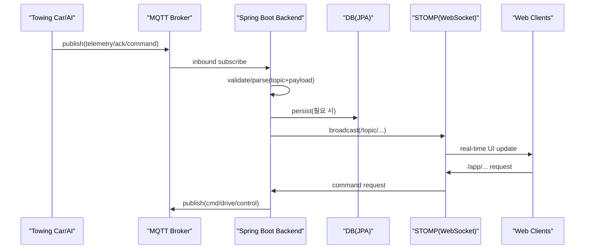

# Autowing Car - 구조/흐름

## 핵심 데이터 흐름(요약)
- Edge(토잉카/AI) → MQTT(Broker) → Backend(Spring Integration) → WebSocket(STOMP) → 관제/기장 웹

## 설계 포인트
- “즉시성(WS)”과 “기록/무결성(DB)”을 분리해서 생각했다.
- 외부 발행(MQTT)은 트랜잭션 커밋 이후로 밀어야 DB 상태와 메시지 발행이 엇갈리지 않는다(After-commit 패턴).

