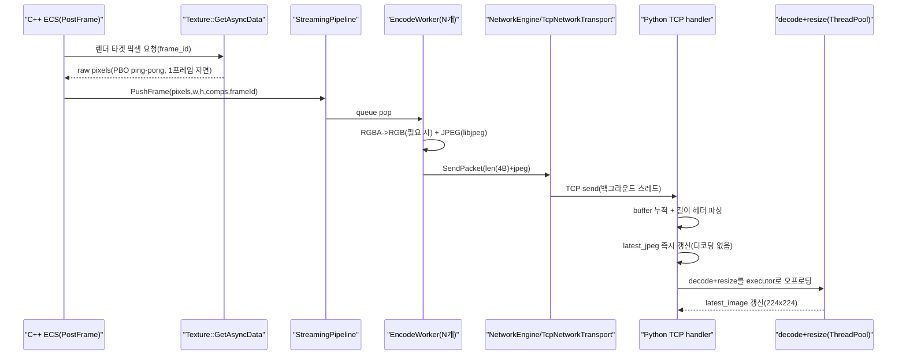

# RobotPal - 구조/흐름

## 전체 흐름(요약)
- 채널 분리:
  - 영상(카메라): C++ → Python (프레임, 대용량, 최신성 우선)
  - 제어(커맨드): Python → C++ (JSON, 소용량, 신뢰성 우선)

## 카메라 스트리밍(Desktop TCP) 흐름

## 카메라 스트리밍(Web) 흐름
- 송신은 동일(인코딩 워커, 길이 헤더 패킷).
- 전송 계층만 WebSocket으로 교체(Emscripten WebSocket API).
- 수신은 Python WebSocket receiver → 동일한 processor로 흘림(Queue size 1).

## 제어 명령(JSON) 흐름
- Python에서 `{type:"drive"| "servo", ...}`를 JSON으로 직렬화하고 길이 헤더(4B)를 붙여 전송.
- C++에서는 수신 패킷에서 JSON을 파싱해서 Drive/Servo 로직으로 반영.

## 리스크(문서로 남겨둔 포인트)
- TCP는 `recv()` 단위가 메시지 경계가 아니라서, “제어 명령 수신”도 버퍼링 파서(링버퍼)가 필요하다.
- 현재 구현이 어디까지 fragmentation을 안전하게 처리하는지는 코드 재점검 필요.

