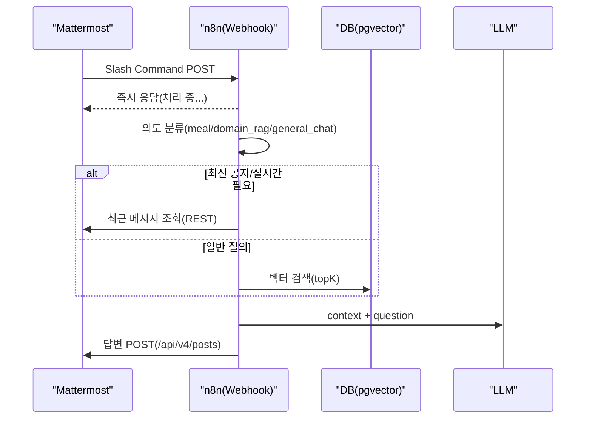

# mm-bot - 아키텍처/흐름

## 전체 구조(요약)
- Mattermost 채널 데이터 → (배치) OCR/임베딩 → pgvector 저장
- Mattermost Slash Command → (실시간) 의도 분류 → 검색/조회 → LLM → Mattermost 응답

## 설계 포인트
- “질의 경로”는 빠르게 끝내야 하므로 읽기 중심.
- “적재 경로”는 느려도 되지만, 중복 방지/체크포인트가 핵심.

