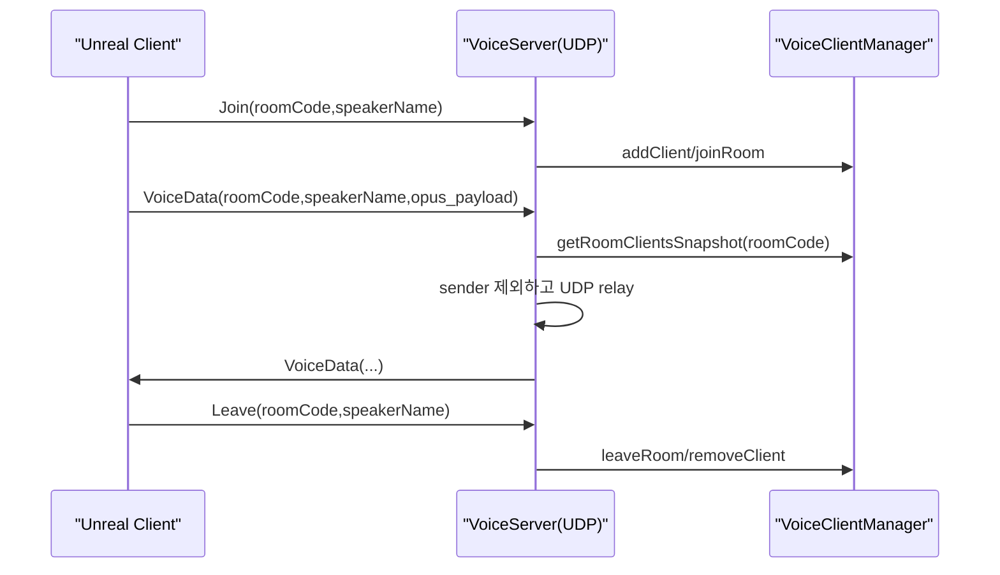

# 영묘 - 구조/흐름

## 서버 구성
- Lobby: WebSocket(uwebsockets) 기반
- Voice: UDP 기반 릴레이 서버

## Voice packet 포맷(요약)
- 고정 헤더 + 가변 payload
  - packetType: Join/VoiceData/Leave
  - roomCode: 16 bytes
  - speakerName: 32 bytes
  - payloadSize: uint32

## 데이터 흐름(요약)

## RoomCode 스코프
- 클라 수신 메시지/이벤트는 RoomCode가 다르면 무시.
- 같은 맵을 여러 방에서 쓰더라도, RoomCode 기반 월드 오프셋을 적용해 “물리적 겹침”을 피한다.

